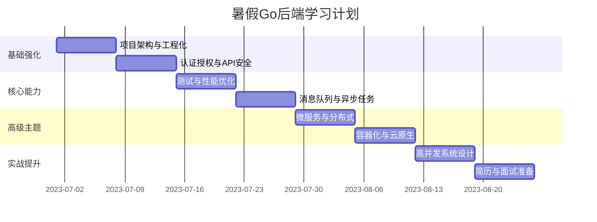

# 暑假两个月 Go 后端开发进阶学习计划（详细版）

以下是针对你的水平（已掌握 Go 基础、Gin 和 GORM）制定的详细学习计划，包含每日任务、项目实践和资源推荐：

## 整体规划


## 每周详细计划

### 第1周：项目架构与工程化

**目标**：构建可维护的企业级项目结构

**每日计划**：
1. **周一**：研究项目结构
   - 学习标准项目布局：`/cmd`, `/internal`, `/pkg`
   - 实现分层架构：Handler → Service → Repository
   - 实践：重构现有项目为分层结构

2. **周二**：配置管理
   - 掌握 Viper 配置管理
   - 支持多环境配置（dev/test/prod）
   - 实践：将硬编码配置迁移到 YAML/ENV

3. **周三**：日志系统
   - 集成 Zap 日志库
   - 实现日志分级（DEBUG/INFO/ERROR）
   - 实践：添加请求日志中间件

4. **周四**：错误处理
   - 统一错误处理中间件
   - 自定义错误码体系
   - 实践：全局错误处理器

5. **周五**：文档生成
   - 使用 Swagger 生成 API 文档
   - 编写 API 注释规范
   - 实践：为现有 API 添加 Swagger 注释

**周末项目**：构建用户管理系统基础框架
- 技术栈：Gin + GORM + Viper + Zap
- 功能：用户注册/登录（不含认证）

**资源**：
- [Go 项目标准布局](https://github.com/golang-standards/project-layout)
- [Viper 配置管理教程](https://www.youtube.com/watch?v=5U2T_2Fh0dM)

### 第2周：认证授权与API安全

**目标**：实现安全的用户认证和API防护

**每日计划**：
1. **周一**：JWT 认证
   - JWT 原理与组成
   - 实现 JWT 签发与验证
   - 实践：在用户系统中添加 JWT 登录

2. **周二**：OAuth2.0 集成
   - OAuth2 授权流程
   - GitHub/Google OAuth 集成
   - 实践：添加"使用 GitHub 登录"功能

3. **周三**：API 安全
   - CORS 跨域配置
   - 速率限制（Rate Limiting）
   - 实践：添加 API 访问频率限制

4. **周四**：数据安全
   - 密码哈希存储（bcrypt）
   - SQL 注入防护
   - 实践：实现密码哈希与验证

5. **周五**：权限控制
   - RBAC 权限模型
   - 中间件实现权限验证
   - 实践：添加管理员/普通用户角色

**周末项目**：完善用户管理系统
- 添加 OAuth 登录
- 实现角色权限控制
- 添加 API 速率限制

**资源**：
- [JWT 官方文档](https://jwt.io/introduction)
- [OAuth2 实战指南](https://developer.okta.com/blog/2018/06/29/how-oauth-2-works)

### 第3周：测试与性能优化

**目标**：编写可靠代码并优化性能

**每日计划**：
1. **周一**：单元测试
   - Testify 测试框架
   - Mock 数据库操作
   - 实践：为用户服务编写测试

2. **周二**：集成测试
   - 测试 HTTP 接口
   - 使用 Docker 创建测试数据库
   - 实践：编写 API 端点测试

3. **周三**：性能分析
   - pprof 工具使用
   - 分析 CPU/内存使用
   - 实践：定位性能瓶颈

4. **周四**：缓存优化
   - Redis 基础操作
   - 缓存击穿/穿透/雪崩解决方案
   - 实践：添加 Redis 缓存层

5. **周五**：压力测试
   - 使用 wrk 进行压力测试
   - 优化数据库查询
   - 实践：优化高并发场景性能

**周末项目**：博客系统 V1.0
- 技术栈：Gin + GORM + Redis
- 功能：文章 CRUD + 缓存优化
- 要求：测试覆盖率 > 70%

**资源**：
- [Go 测试进阶](https://quii.gitbook.io/learn-go-with-tests/)
- [pprof 实战](https://github.com/google/pprof)

### 第4周：消息队列与异步任务

**目标**：实现解耦和后台任务处理

**每日计划**：
1. **周一**：RabbitMQ 基础
   - 消息队列概念
   - 安装与基本使用
   - 实践：发送/接收简单消息

2. **周二**：任务队列
   - 工作队列模式
   - 消息持久化
   - 实践：创建异步任务队列

3. **周三**：邮件服务
   - SMTP 协议基础
   - 邮件模板设计
   - 实践：实现邮件发送功能

4. **周四**：异步通知
   - 将邮件发送加入队列
   - 错误重试机制
   - 实践：新评论邮件通知

5. **周五**：定时任务
   - Cron 表达式
   - 定时任务框架
   - 实践：每日数据统计报表

**周末项目**：博客系统 V2.0
- 添加评论功能
- 实现新评论邮件通知（异步）
- 添加每日统计定时任务

**资源**：
- [RabbitMQ 教程](https://www.rabbitmq.com/getstarted.html)
- [Go 邮件库](https://github.com/go-gomail/gomail)

### 第5周：微服务与分布式

**目标**：构建分布式系统基础

**每日计划**：
1. **周一**：gRPC 基础
   - Protocol Buffers
   - 定义 gRPC 服务
   - 实践：创建简单 gRPC 服务

2. **周二**：服务拆分
   - 微服务拆分原则
   - 领域驱动设计基础
   - 实践：将博客系统拆分为用户服务和内容服务

3. **周三**：服务发现
   - Consul 服务注册与发现
   - 健康检查机制
   - 实践：服务注册与发现

4. **周四**：分布式配置
   - 配置中心概念
   - Consul KV 存储配置
   - 实践：集中管理微服务配置

5. **周五**：分布式追踪
   - OpenTracing 概念
   - Jaeger 集成
   - 实践：追踪跨服务请求

**周末项目**：微服务版电商系统
- 服务：用户服务、商品服务、订单服务
- 通信：gRPC
- 基础设施：Consul + Jaeger

**资源**：
- [gRPC 官方教程](https://grpc.io/docs/languages/go/basics/)
- [Consul 入门](https://learn.hashicorp.com/consul)

### 第6周：容器化与云原生

**目标**：掌握容器化和云部署

**每日计划**：
1. **周一**：Docker 基础
   - Dockerfile 编写
   - 多阶段构建
   - 实践：容器化 Go 应用

2. **周二**：Docker Compose
   - 多容器管理
   - 网络配置
   - 实践：本地运行微服务系统

3. **周三**：Kubernetes 基础
   - Pod/Deployment/Service
   - Minikube 本地集群
   - 实践：部署应用到 K8s

4. **周四**：云服务部署
   - 选择云平台（AWS/Aliyun）
   - 创建 K8s 集群
   - 实践：部署应用到云端

5. **周五**：CI/CD 基础
   - GitHub Actions 配置
   - 自动化构建与部署
   - 实践：设置 CI/CD 流水线

**周末项目**：部署电商系统到云平台
- 使用 Docker Compose 本地运行
- 使用 K8s 部署到云端
- 配置 CI/CD 流水线

**资源**：
- [Docker 官方教程](https://docs.docker.com/get-started/)
- [Kubernetes 学习路径](https://kubernetes.io/docs/tutorials/kubernetes-basics/)

### 第7周：高并发与系统设计

**目标**：设计高性能系统

**每日计划**：
1. **周一**：Go 并发模式
   - Worker Pool 模式
   - Pipeline 模式
   - 实践：实现并发任务处理器

2. **周二**：连接池管理
   - 数据库连接池配置
   - HTTP 连接池优化
   - 实践：优化高并发服务

3. **周三**：熔断与降级
   - 熔断器模式
   - Hystrix 实现
   - 实践：添加服务熔断机制

4. **周四**：系统设计基础
   - 负载均衡策略
   - 缓存策略设计
   - 实践：设计短链服务架构

5. **周五**：实战项目设计
   - 需求分析
   - 架构设计
   - 技术选型

**周末项目**：高并发短链服务
- 功能：长短链接转换
- 要求：支持 1000+ QPS
- 技术：Redis + 连接池 + 熔断

**资源**：
- [Go 并发模式](https://go.dev/blog/pipelines)
- [系统设计入门](https://github.com/donnemartin/system-design-primer)

### 第8周：简历准备与面试

**目标**：准备求职材料并模拟面试

**每日计划**：
1. **周一**：项目整理
   - 优化 GitHub 项目
   - 编写完善 README
   - 添加项目文档

2. **周二**：技术博客
   - 选择 2 个技术主题
   - 撰写深度技术文章
   - 发布到平台（Medium/掘金）

3. **周三**：简历制作
   - 简历结构设计
   - 项目经验描述技巧
   - 量化成果展示

4. **周四**：面试准备
   - Go 核心面试题
   - 系统设计面试题
   - 行为面试问题

5. **周五**：模拟面试
   - 寻找面试伙伴
   - 进行技术模拟面试
   - 获取反馈并改进

**周末任务**：
1. 完成个人技术简历
2. 准备 3 个"STAR"模式项目案例
3. 创建个人作品集网站

**资源**：
- [Go 面试题集](https://github.com/0voice/Introduction-to-Golang)
- [技术简历范例](https://github.com/sb2nov/resume)

## 项目组合建议

### 核心项目：电商系统
```
├── 用户服务 (gRPC)
├── 商品服务 (gRPC)
├── 订单服务 (gRPC)
├── API 网关 (Gin)
├── 后台管理 (Vue.js)
└── 基础设施：
    ├── Docker 容器化
    ├── Kubernetes 部署
    ├── Redis 缓存
    └── RabbitMQ 消息队列
```

### 技术亮点项目：实时协作平台
```
├── 实时文档协作 (WebSocket)
├── 版本历史记录
├── 用户权限管理 (RBAC)
└── 技术亮点：
    ├── CRDT 冲突解决算法
    ├── 自动保存与恢复
    └── 操作历史回放
```

### 工具类项目：开发者工具箱
```
├── JSON 格式化
├── Base64 编码解码
├── 时间戳转换
└── 技术特色：
    ├── PWA 支持
    ├── 插件系统
    └── 快捷键操作
```

## 每日时间表示例


## 学习效率技巧

1. **番茄工作法**：25分钟专注 + 5分钟休息
2. **费曼学习法**：尝试向他人解释你学到的概念
3. **项目驱动**：每个新技术都应用到实际项目中
4. **代码审查**：定期审查自己的代码并重构
5. **社区参与**：每周参与一次开源项目讨论

## 推荐工具栈

| 类别       | 工具推荐                |
| ---------- | ----------------------- |
| IDE        | VS Code + Go 插件       |
| 版本控制   | Git + GitHub            |
| 数据库工具 | TablePlus/DBeaver       |
| API 测试   | Postman/Insomnia        |
| 容器管理   | Docker + Docker Compose |
| 云平台     | AWS/Aliyun 免费套餐     |
| 笔记工具   | Obsidian/Notion         |

这个计划将帮助你系统性地提升 Go 后端开发能力，从基础架构到高级主题，最终形成完整的项目组合和求职能力。关键是要坚持每天编码，遇到问题及时查阅文档和社区资源。祝你学习顺利！